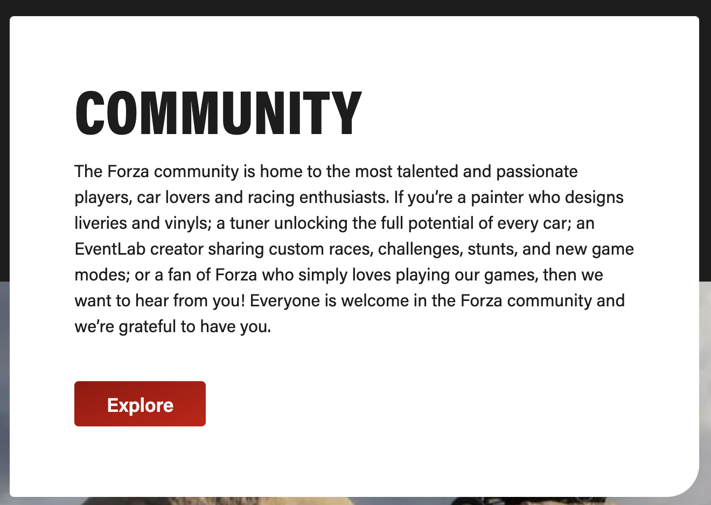
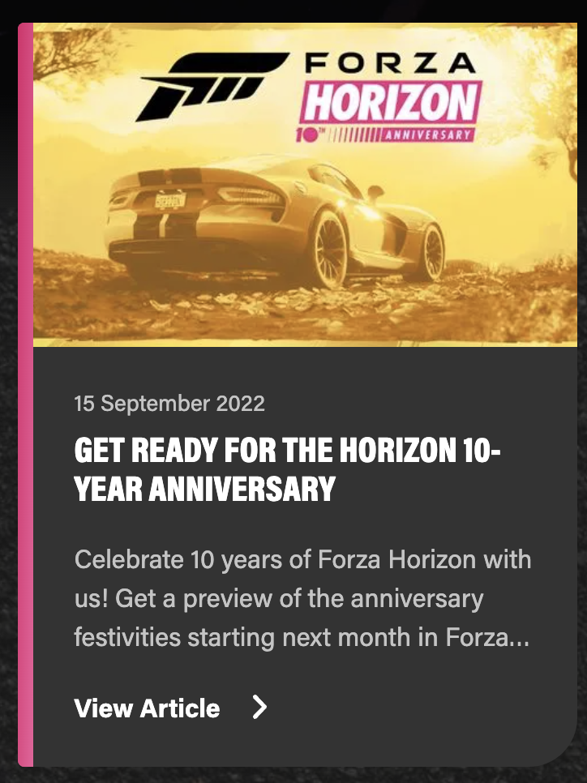
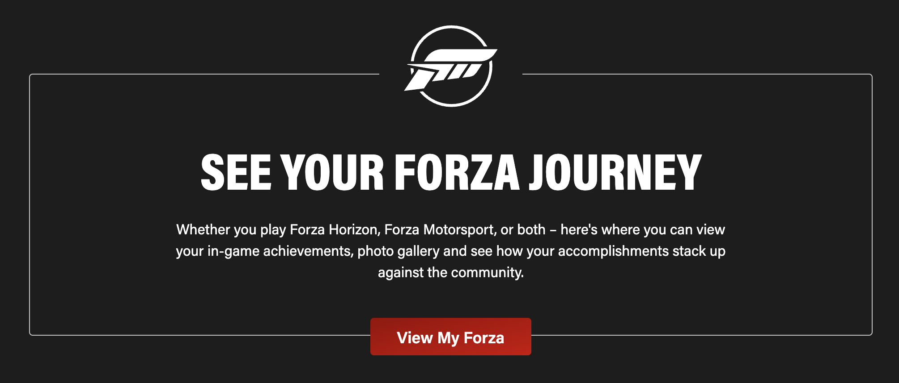

# Week 3 Projects

### Font
```html
<link rel="preconnect" href="https://fonts.googleapis.com">
<link rel="preconnect" href="https://fonts.gstatic.com" crossorigin>
<link href="https://fonts.googleapis.com/css2?family=Open+Sans:wght@300;400;500;600;700;800&display=swap" rel="stylesheet">
```

```css
font-family: 'Open Sans', sans-serif;
```

---

## Project 1
Forza Post



---

## Project 2
Forza Display Card



---

## Project 3
Forza Info Element


